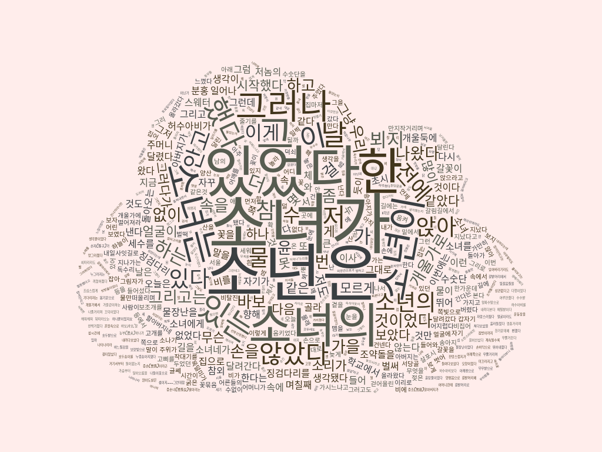
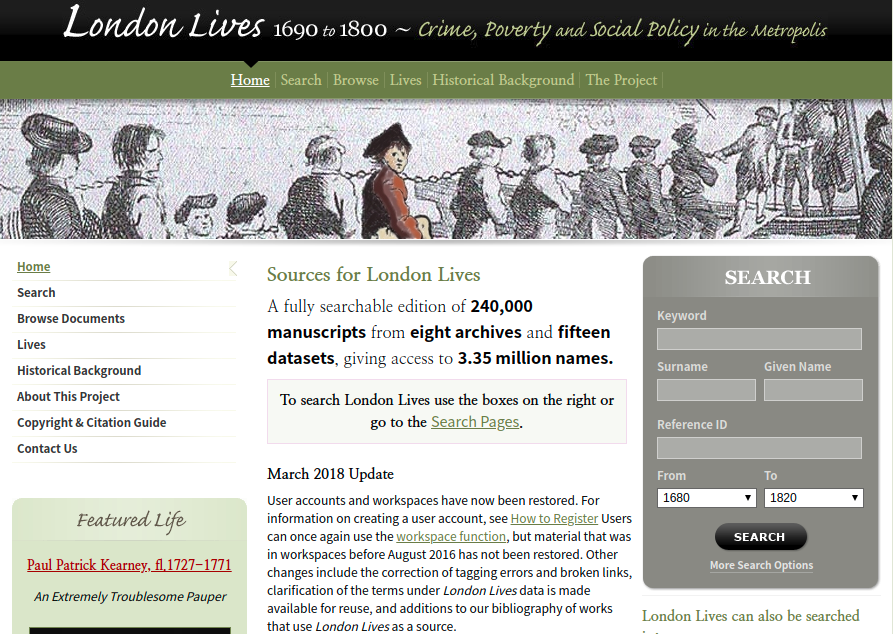

### 인문학자가 코딩을 해야 하는 이유

우리는 정보의 홍수 속에서 살고 있습니다. 예전에는 어떤 연구를 할 때에는 누가 어떤 자료를 확보하고 있는가가 중요했지만 지금은 자료에 대한 접근성이 엄청나게 높아졌습니다. 누구나 원하는 자료를 쉽게 찾을 수 있을 뿐더러 굳이 도서관이나 서점에 가지 않아도 왠만한 자료들을 얻을 수 있습니다. 

그렇기 때문에 이제 중요한 것은 정보의 양이 아니라 이미 확보하고 있는 정보를 어떻게 가공하고 선별해 낼 수 있느냐의 문제인 것 같습니다. 정보를 가공한다는 것은 우리가 가지고 있는 데이터들을 유의미하게 분류해 내는 과정입니다. 그런데 수많은 텍스트 자료들을 일일이 검토하면서 유의미한 결과들을 뽑아내기란 여간 힘든 것이 아닙니다. 이런 작업들을 위해 디지털 기술이 상당히 도움이 될 수 있습니다. 

### 소설 소나기

예를 들면, 황순원의 소나기라는 소설을 읽을 때, 우리는 그 플롯에 주된 관심을 둡니다. 그러나 디지털 기술의 도움을 받으면 뭔가 다른 정보를 얻어낼 수 있습니다. 텍스트의 양적 분석은 가장 간단하면서도 기본적인 텍스트 가공 기술이라고 볼 수 있습니다. 텍스트에 사용된 단어들의 양적 통계를 통해 어떤 단어, 혹은 어떤 품사가 많이 사용되었는지를 파악해 보는 것입니다. 

이런 분석 방법은 사람이 일일이 하는 것이 거의 불가능하지만 컴퓨터는 극히 짧은 시간안에 결과를 보여줄 수 있습니다. 아래는 단어 구름(word cloud) 프로그램을 통해 황순원의 소나기를 분석한 결과입니다(이런 방식의 프로그램을 함께 만들어 보려고 합니다).   

위의 분석 결과로 볼 때, 황순원 작가는 "소년은"과 "소녀가"의 구문을 가장 많이 사용하고 있는 것을 알 수 있습니다. 이 소설은 소년과 소녀의 행동 묘사에 중점을 두고 서술되고 있는 것이죠. 

이는 간단한 분석에 불과하기는 하지만 위와 같이 시각적으로 데이터를 표현하는 것만으로도 무언가 새로운 각도에서 텍스트를 바라보게 합니다. 그러면 뭔가 좀 더 의미있는 작업의 예를 찾아볼까요? 

### 디지털 인문학의 실제 사례 - 17세기 평범한 사람들의 역사

위 이미지는 런던의 삶(London Lives)이라는 제목의 사이트입니다. 제목에서도 볼 수 있듯이 1960년부터 1800년 사이의 런던의 삶을 데이터베이스화 한 것입니다. 그런데 이 사트에서 보여주고자 하는 것은 유명한 사람들의 역사나 회고 기록이 아닌, 평범한 사람들의 역사입니다. 지금이야 개인 기록이 발달한 때이기 때문에, 개인의 역사를 추적하는 것은 어려운 일은 아니지만, 기록의 수단이 제한되어 있던 옛 시대에 개인의 역사를 추적하고 만든다는 것은 거의 불가능한 일이었습니다. 

그런데 이 프로젝트는 24만건이나 되는 당시의 법률/행정 문서를 분석하고 그 안의내용에 디지털 태그를 일일이 붙여서(이를테면 특정한 단어가 사람 이름인지, 장소인지 등등), 디지털 문헌 분석을 통해 한 일반인의 삶을 조명해 볼 수 있는 것입니다. 예를 들면, 출생 문서에는 한 사람의 이름, 태어난 장소, 그리고 부모에 대한 기록이 있습니다. 그리고 그 사람이 범죄를 저질렀다면 법률 문서에 재판 기록이 있겠죠. 그리고 사망 확인서에는 그 사람이 왜 어떻게 죽었는지에 대한 기록이 있을 것입니다. 24만건의 문서 기록을 사람이 분석하는 것은 불가능하지만 컴퓨터가 이를 대행해 주었을 때, 흥미로운 결과를 보여주는 것입니다. 

지금 이 사이트의 메인페이지에는 [Paul Patrick Kearney](https://www.londonlives.org/static/KearneyPaulPatrick.jsp)라는 사람의 링크가 달려 있습니다. 그 별명은 "엄청난 골칫덩이 가난뱅이"네요. 각종 사기와 범죄를 일삼은 사람의 삶이 그려져 있습니다. 관심 있으신 분은 한번 어떤 식으로 데이터가 분석되고 구성되는지 이 사이트를 돌아보시면 좋을 것 같습니다. 

앞으로 이 블로그에서는 코딩을 통해 어떤 방식으로 디지털 문헌 분석을 할 수 있는지 나눠 보도록 하겠습니다.  
